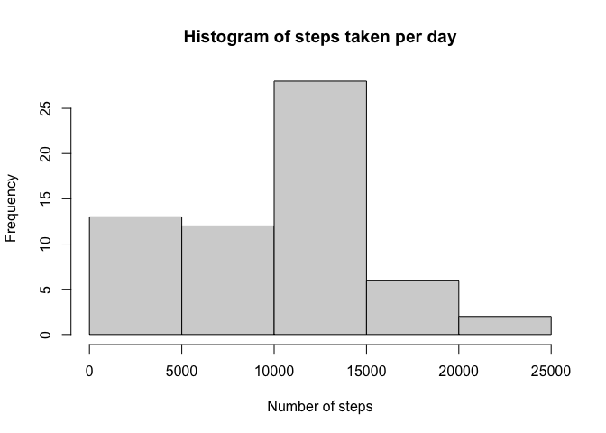
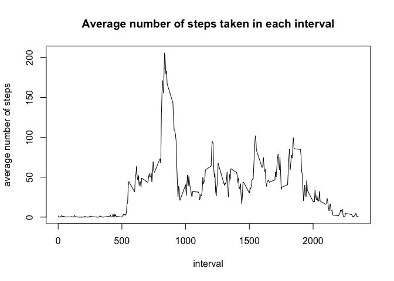
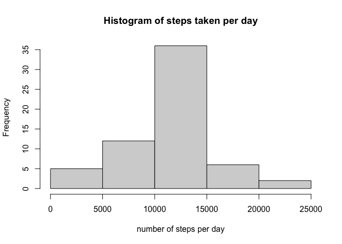
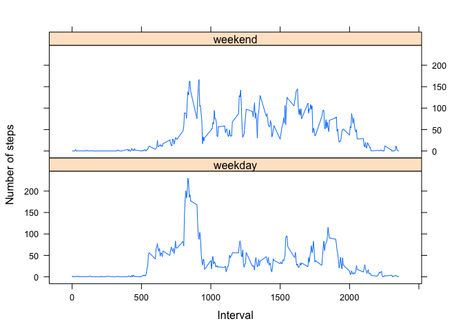

Please see README for introduction of this project.  

## Loading and preprocessing the data

First, download the data file and unzip it. 

```r
# set the working directory to the direction of the file. 
setwd(dirname(rstudioapi::getActiveDocumentContext()$path))
# download and unzip
URL <- "https://d396qusza40orc.cloudfront.net/repdata%2Fdata%2Factivity.zip"
destFile <- "data.zip"
if (!file.exists(destFile)){
    download.file(URL, destfile = destFile, mode='wb')
}
if (file.exists(destFile)){
    unzip(destFile)
}
dateDownloaded <- date()
```

Read data

```r
data <- read.csv("activity.csv") 
str(data)
```

```
## 'data.frame':	17568 obs. of  3 variables:
##  $ steps   : int  NA NA NA NA NA NA NA NA NA NA ...
##  $ date    : chr  "2012-10-01" "2012-10-01" "2012-10-01" "2012-10-01" ...
##  $ interval: int  0 5 10 15 20 25 30 35 40 45 ...
```

The class of date is characters. Let's fix it. 

```r
data <- transform(data, date = strptime(date, "%Y-%m-%d"))
class(data$date)
```

```
## [1] "POSIXlt" "POSIXt"
```


## What is mean total number of steps taken per day?
For this part of the assignment, you can ignore the missing values in the dataset.

#### 1. Calculate the total number of steps taken per day

```r
library(dplyr)
steps_by_day <- data  %>% group_by(date)  %>% summarise(steps = sum(steps, na.rm = TRUE))
head(steps_by_day)
```

```
## # A tibble: 6 x 2
##   date                steps
##   <dttm>              <int>
## 1 2012-10-01 00:00:00     0
## 2 2012-10-02 00:00:00   126
## 3 2012-10-03 00:00:00 11352
## 4 2012-10-04 00:00:00 12116
## 5 2012-10-05 00:00:00 13294
## 6 2012-10-06 00:00:00 15420
```

#### 2. If you do not understand the difference between a histogram and a barplot, research the difference between them. Make a histogram of the total number of steps taken each day. 

```r
hist(steps_by_day$steps, xlab = "Number of steps", main = "Histogram of steps taken per day")
```

<!-- -->

#### 3. Calculate and report the mean and median of the total number of steps taken per day. 

The mean and median  of the total number of steps taken per day are:

```r
mean(steps_by_day$steps)
```

```
## [1] 9354.23
```

```r
median(steps_by_day$steps)
```

```
## [1] 10395
```

## What is the average daily activity pattern?

#### 1. Make a time series plot (i.e.type = "l") of the 5-minute interval (x-axis) and the average number of steps taken, averaged across all days (y-axis).


```r
steps_by_int <- data  %>% group_by(interval)  %>% summarise(steps = mean(steps, na.rm = TRUE))
plot(steps_by_int, type = 'l', xlab = "interval", ylab = "average number of steps",  main = "Average number of steps taken in each interval")
```

<!-- -->

#### 2. Which 5-minute interval, on average across all the days in the dataset, contains the maximum number of steps?

```r
max_row <- which.max(steps_by_int$steps)
steps_by_int$interval[max_row]
```

```
## [1] 835
```


## Imputing missing values
Note that there are a number of days/intervals where there are missing values (coded as NA). The presence of missing days may introduce bias into some calculations or summaries of the data.

#### 1. Calculate and report the total number of missing values in the dataset (i.e. the total number of rows with NAs)

First we compute the number of NAs in each column:

```r
sum(is.na(data$date))
```

```
## [1] 0
```

```r
sum(is.na(data$interval))
```

```
## [1] 0
```

```r
sum(is.na(data$steps))
```

```
## [1] 2304
```

Since the date and interval columns don't have any NAs. The total number of rows with NAs is 2304. 
   
#### 2. Devise a strategy for filling in all of the missing values in the dataset. The strategy does not need to be sophisticated. For example, you could use the mean/median for that day, or the mean for that 5-minute interval, etc.

Let's fill in the missing values by the mean for that 5-minute interval. For sanity check, let's make sure the means don't have any NA. 

```r
sum(is.na(steps_by_int$steps))
```

```
## [1] 0
```

Great! The strategy works! 

#### 3. Create a new dataset that is equal to the original dataset but with the missing data filled in.

```r
# create a copy of the original data 
filled_data <- data
for (i in c(1:nrow(data))) {
    if (is.na(data$steps[i])) {
        interval <- data$interval[i]
        filled_data$steps[i] <- mean(steps_by_int$steps[steps_by_int$interval == interval])
    }
}
```

The resulting dataframe is called filled_data. Let's make sure it doesn't contain any NAs. 


```r
sum(is.na(filled_data))
```

```
## [1] 0
```


#### 4. Make a histogram of the total number of steps taken each day. Calculate and report the mean and median total number of steps taken per day. Do these values differ from the estimates from the first part of the assignment? What is the impact of imputing missing data on the estimates of the total daily number of steps?


```r
steps_by_day_new <- filled_data  %>% group_by(date)  %>% summarise(steps = sum(steps, na.rm = TRUE))
hist(steps_by_day_new$steps, xlab = "number of steps per day", main = "Histogram of steps taken per day")
```

<!-- -->

mean and median:

```r
mean(steps_by_day_new$steps)
```

```
## [1] 10766.19
```

```r
median(steps_by_day_new$steps)
```

```
## [1] 10766.19
```


The number of steps per day become larger after filling values since some NA values (originally counted with 0) in the days are filled in with average numbers in that interval. 

## Are there differences in activity patterns between weekdays and weekends?
For this part the `weekdays()` function may be of some help here. Use the dataset with the filled-in missing values for this part.

#### 1. Create a new factor variable in the dataset with two levels – “weekday” and “weekend” indicating whether a given date is a weekday or weekend day.


```r
# First determine if a date is weekend (TRUE) or weekday (FALSE)
filled_data$weekend <- factor(weekdays(filled_data$date) %in% c("Saturday", "Sunday"))
# change names of factor: TRUE -> weekend, FALSE -> weekday
levels(filled_data$weekend)[levels(filled_data$weekend)=="TRUE"] <- "weekend"
levels(filled_data$weekend)[levels(filled_data$weekend)=="FALSE"] <- "weekday"
# see result
head(filled_data)
```

```
##       steps       date interval weekend
## 1 1.7169811 2012-10-01        0 weekday
## 2 0.3396226 2012-10-01        5 weekday
## 3 0.1320755 2012-10-01       10 weekday
## 4 0.1509434 2012-10-01       15 weekday
## 5 0.0754717 2012-10-01       20 weekday
## 6 2.0943396 2012-10-01       25 weekday
```


#### 2. Make a panel plot containing a time series plot (i.e. type = "l") of the 5-minute interval (x-axis) and the average number of steps taken, averaged across all weekday days or weekend days (y-axis). See the README file in the GitHub repository to see an example of what this plot should look like using simulated data.


```r
steps_by_weekend <- filled_data %>% group_by(weekend, interval) %>% summarize(steps = mean(steps))
library(lattice)
xyplot(steps ~interval| weekend, data = steps_by_weekend, layout = c(1,2), type = 'l', 
       xlab = 'Interval', ylab = 'Number of steps')
```

<!-- -->

Looks like the person moves more in the morning and rest more in the afternoon in the weekends. 

